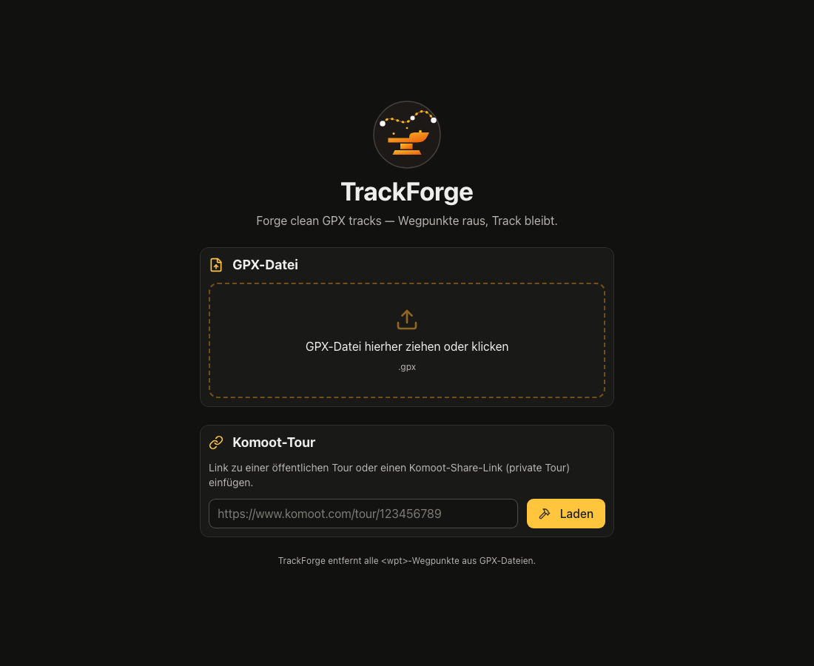
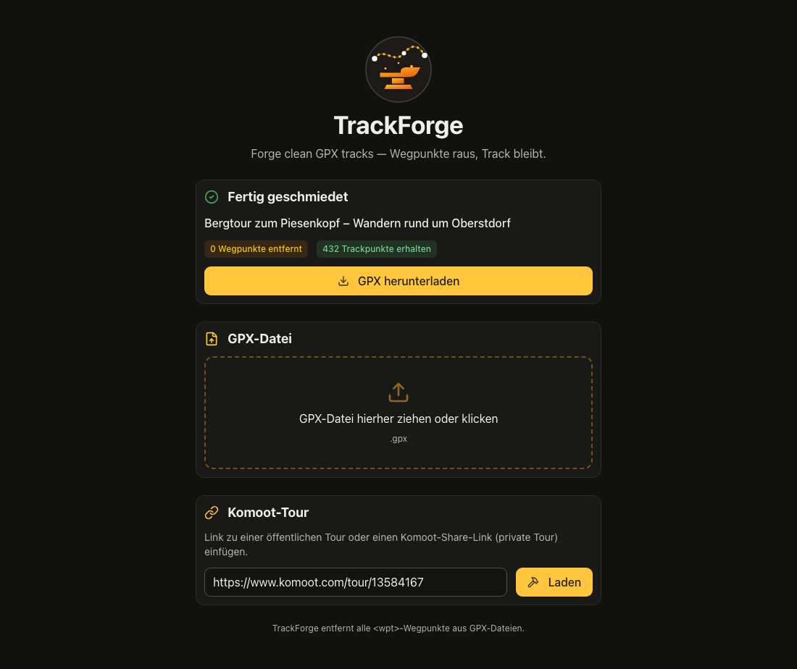

<p align="center">
  
</p>

<h1 align="center">TrackForge</h1>

<p align="center"><em>Forge clean GPX tracks — Wegpunkte raus, Track bleibt.</em></p>

TrackForge ist eine kleine Web-App, die GPX-Dateien von allen `<wpt>`-Wegpunkten
befreit und dabei den Track unverändert lässt. Praktisch z.&nbsp;B. für
Brevet-Strecken, bei denen Kontrollpunkte als Wegpunkte eingebettet sind, das
Navigationsgerät aber nur den Track bekommen soll.

## Features

- **GPX-Upload** per Drag & Drop oder Dateiauswahl
- **Komoot-Import** per Link:
  - öffentliche Touren (`https://www.komoot.com/tour/<id>`)
  - private Touren über einen Komoot-Share-Link (`…?share_token=…`,
    über „Teilen → Link kopieren“ in Komoot)
- Entfernt alle `<wpt>`-Elemente (auch selbstschließende), Trackpunkte,
  Routen und Metadaten bleiben erhalten
- Download als `<name>_clean.gpx`

| Startseite | Ergebnis |
|---|---|
|  |  |

## Schnellstart (Docker)

```bash
docker build -t trackforge .
docker run -p 8000:8000 trackforge
```

Dann <http://localhost:8000> öffnen.

> **Hinweis zum Port:** Die Backend-URL (`localhost:8000`) wird beim Build ins
> Frontend eingebettet. Den Container daher auf Host-Port 8000 mappen.
> Hinter einem HTTPS-Reverse-Proxy funktioniert die App auf beliebigen
> Domains, da das Frontend die URL dann zur Laufzeit normalisiert. Nur ein
> abweichender Plain-HTTP-Port (z. B. `-p 9000:8000`) bricht die
> WebSocket-Verbindung.

## Entwicklung

Voraussetzungen: [uv](https://docs.astral.sh/uv/)

```bash
uv sync --group dev      # Abhängigkeiten installieren
uv run reflex run        # Dev-Server (Frontend :3000, Backend :8000)
uv run pytest            # Unit-Tests
```

### Screenshots aktualisieren

```bash
uv run playwright install chromium   # einmalig
docker run -d --name shot -p 8000:8000 trackforge
uv run python tests/screenshot.py
docker rm -f shot
```

## Architektur

```
trackforge/
├── rxconfig.py                 # Reflex-Konfiguration (Theme, Plugins)
├── trackforge/
│   ├── trackforge.py           # UI + State (Reflex, eine Seite)
│   ├── gpx.py                  # Wegpunkt-Entfernung (reine Funktionen)
│   └── komoot.py               # Komoot-API-Zugriff
├── assets/logo.svg             # Logo
├── tests/                      # pytest-Unit-Tests + Screenshot-Script
└── Dockerfile                  # Single-Port-Produktions-Image
```

- **Frontend/Backend:** [Reflex](https://reflex.dev) (Pure Python). Im
  Docker-Image wird das Frontend mit `reflex export` statisch gebaut und vom
  Backend (Uvicorn, Port 8000) mit ausgeliefert
  (`__REFLEX_MOUNT_FRONTEND_COMPILED_APP=1`).
- **GPX-Verarbeitung** (`gpx.py`): entfernt `<wpt>`-Blöcke per Regex auf dem
  Roh-Text — die Datei wird ansonsten byte-genau erhalten (kein
  XML-Reserialisieren).
- **Komoot** (`komoot.py`): nutzt die inoffizielle v007-API. Der
  `.gpx`-Endpunkt verlangt auch für öffentliche Touren Authentifizierung,
  daher wird die GPX aus dem Koordinaten-JSON
  (`/api/v007/tours/<id>?_embedded=coordinates`) gebaut. Ein `share_token`
  aus dem eingegebenen Link wird durchgereicht und schaltet private Touren
  frei. Da die API inoffiziell ist, kann sich das Verhalten jederzeit ändern.

## Lizenz

[MIT](LICENSE)
